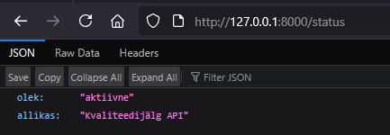
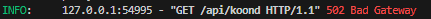

# Backend – FastAPI koondteenus

## Eeldused
- Python 3.11+
- Virtuaalkeskkond (soovituslik)

## Kiirstart
**macOS/Linux**
```bash
cd /Users/robinrattasep/testing_project/backend
python -m venv .venv
source .venv/bin/activate
pip install -r requirements.txt
cd /Users/robinrattasep/testing_project
uvicorn backend.main:rakendus --reload
# või backend kaustast:
# uvicorn main:rakendus --reload --app-dir /Users/robinrattasep/testing_project/backend
```

**Windows (PowerShell)**
```powershell
cd C:\Users\<user>\testing_project\backend
python -m venv .venv
.\.venv\Scripts\Activate.ps1
pip install -r requirements.txt
cd C:\Users\<user>\testing_project
uvicorn backend.main:rakendus --reload
# või backend kaustast:
# uvicorn main:rakendus --reload --app-dir C:\Users\<user>\testing_project\backend
```

Endpointid:
- `GET /status` – tervisekontroll.
- `GET /api/koond` – kombineeritud JSONPlaceholder + Rick & Morty vastus.

## Kvaliteedivihjed
- Muuda URL-e keskkonnamuutujatega, kui testid nõuavad.
- Logi kõik vead näitamaks riskide maandamist.

Endpointid:
- `GET /status` – tervisekontroll.




- `GET /api/koond` – kombineeritud JSONPlaceholder + Rick & Morty vastus.


-  Veaolukorras naaseb 502 koos detailse kirjega;




## Kvaliteedivihjed
- Muuda URL-e keskkonnamuutujatega, kui testid nõuavad.
- Logi kõik vead näitamaks riskide maandamist.
